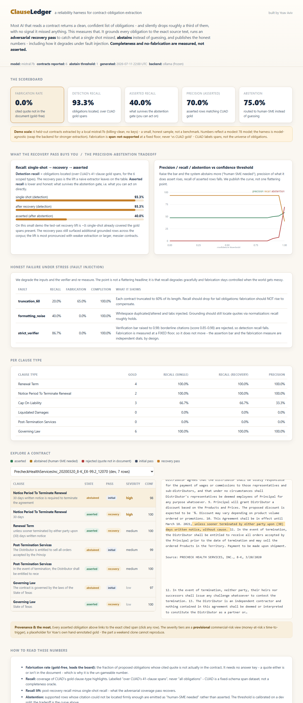

# ClauseLedger

**A reliability harness for contract-obligation extraction.** Not another contract AI - it
*measures* how often an extractor silently misses or fabricates obligations, recovers the misses,
abstains instead of guessing, and publishes honest numbers, including how it degrades under fault
injection.

[](https://github.com/yoavaviv/clauseledger/actions)
· License: PolyForm Noncommercial 1.0.0 · Data: CUAD v1 (CC BY 4.0)

> **Live demo:** open [`demo/index.html`](demo/index.html) in a browser (static, no server, no
> keys). Screenshot below.



---

## The problem

Ask an AI to "list the obligations in this contract" and it returns a clean, confident list - and
silently drops roughly a third of them, with no signal it missed anything. In a contract, a missed
auto-renewal notice or an unclaimed service-level credit is real money; a fabricated obligation in
a review memo is real liability. So teams re-read every contract by hand anyway, and the AI never
runs unattended. **The gap between a good demo and something you can trust is the whole problem.**

## What it is / is not

- **Is:** a measurement + reliability layer. Every obligation is grounded to the exact source span;
  an independent verifier rejects citations that are not in the document; an adversarial coverage
  pass recovers what the first pass missed; the system abstains ("human-SME needed") instead of
  guessing; and it reports recall, precision, fabrication, abstention, and failure-under-fault.
- **Is not:** a contract summarizer, a CLM product, or a leaderboard of models. The extractor is
  pluggable and deliberately modest (see ADR 0004); the harness on top is the point.

## How it works

```
contract text
   |
   v  extract (per clause type, exhaustive long-context - NOT retrieval-RAG; ADR 0006)
initial candidates ------------------------+
   |                                        |
   v  adversarial coverage pass             |  "what obligation of this type is present
recovered candidates                        |   but NOT already found?"  -> recall lift
   |                                        |
   +----------------+-----------------------+
                    v
        verify (ground each cited quote to a real span; reject if not in the document)
                    v
        abstain (confidence below calibrated threshold -> "human-SME needed")
                    v
        severity (provisional commercial-risk view; ADR 0005)
                    v
        metrics + fault injection  ->  frozen JSON  ->  static explorer UI
```

**Row states are mutually exclusive:** *asserted* (grounded, high-confidence), *abstained*
(grounded, low-confidence, routed to a human), *rejected* (quote not in the document = fabrication).

## The numbers (honest by construction)

| Metric | Definition |
|---|---|
| **Fabrication rate** | Fraction of proposed obligations whose quote is **not in the document**, decided at a **fixed floor** independent of the verification threshold - gold-free and un-gameable (ADR 0001). Leads the scoreboard. |
| **Detection recall** | Gold obligations *located* (over CUAD's 41-clause-type spans), single-shot vs after the recovery pass. The difference is **recall lift**. |
| **Asserted recall** | Covered only by *asserted* rows - the number you can act on directly. Always <= detection recall (ADR 0002). |
| **Precision** | Of asserted rows, the fraction matching CUAD gold. |
| **Abstention** | Supported rows routed to a human instead of asserted. The precision/recall/abstention tradeoff is published as a **Pareto curve**, not one flattering point. |
| **False alarm** | Confident emissions on clause types the contract genuinely lacks. |
| **Fault injection** | Recall + fabrication under truncated inputs, formatting noise, and a stricter verifier. Shows graceful degradation, not a hero headline. |

Recall is always labelled "over CUAD's 41-clause spans", never "all obligations" - CUAD is a
fixed-schema span dataset, not a completeness oracle.

## Technical decisions

Each is a dated ADR in [`docs/adr/`](docs/adr/):
[fabrication gold-free + threshold-free](docs/adr/0001-fabrication-is-gold-free-and-threshold-free.md) ·
[detection vs asserted recall](docs/adr/0002-detection-vs-asserted-recall.md) ·
[static precomputed demo](docs/adr/0003-static-precomputed-demo.md) ·
[local Ollama, weak model on purpose](docs/adr/0004-local-ollama-weak-model-on-purpose.md) ·
[6 clauses + provisional severity](docs/adr/0005-scope-six-clauses-severity-provisional.md) ·
[no RAG, exhaustive windows](docs/adr/0006-no-rag-exhaustive-windows.md)

## Honest limitations

- **Fuzzy grounding can admit stitched fabrications.** A fake quote assembled from real contract
  phrases can score above the fabrication floor. The floor bounds obvious fabrication, not
  adversarial stitching.
- **Recall is measured against CUAD's fixed 41-category schema**, not the true universe of
  obligations. An obligation outside those categories is invisible to the recall number.
- **The extractor is a modest local model.** The absolute numbers reflect `mistral:7b`, not a
  frontier model; the harness is what generalizes. Swap the backend for stronger extraction.
- **Commercial severity is provisional** (see below), not a measured result.
- **Not every extracted term is an "obligation".** Governing Law, Cap On Liability, and Renewal Term are allocations/mechanics, not duties; each row is tagged by kind. Only Notice Period, Liquidated Damages, and Post-Termination Services are genuine obligations.
- **Grounding confirms a quote EXISTS, not that it is operative.** A recital ("WHEREAS...") or a definition can ground perfectly yet not be a binding provision.
- **The six are a demo subset, not the top MSA risks.** Indemnification, uncapped liability / consequential-damages exclusions, and IP/confidentiality would head a production rubric; they are out of scope here. A captured liability cap may be commercially moot if the carve-outs (indemnity, IP, willful misconduct) sit outside it.
- **Governing law is not forum.** The substantive law governing interpretation is distinct from jurisdiction/venue and dispute-resolution, which this tool does not capture.
- **Legal mechanics are deferred to a human by design.** Condition-precedent, survival, materiality, and liquidated-damages enforceability (pre-estimate vs penalty) trigger abstention, not assertion (ADR 0007).

## Reproduce (zero API keys)

```bash
pip install -e ".[dev]"

# recompute the published numbers from cached extractions (instant, deterministic):
python scripts/run_eval.py --backend replay --cache data/cuad/replay_cache.json

# or re-extract locally with your own Ollama model (slow, billing-clean):
python scripts/run_eval.py --backend ollama --model mistral:7b --n 10

# regenerate the frozen demo artifact + bundle:
python scripts/finalize.py && python scripts/build_bundle.py
```

## Tests

```bash
pytest -q --cov=clauseledger        # 970 tests, 93% line coverage
```
Coverage spans the measurement math, the grounding/verification/abstention primitives, backend
robustness (including malformed model output), fault injection, and property-based invariants
(hypothesis). CI runs the suite with a 90% coverage gate.

## The moat / provenance

The reliability engineering is genuinely hard; the un-copyable part is the **commercial-severity
judgment** - which missed obligation actually bleeds money - drawn from 20 years of enterprise
bid/contract experience. This repo ships a **provisional** severity rubric (money-at-risk x
time-to-trigger) as a labelled placeholder; the hand-annotated commercial-severity gold on real
SaaS master service agreements is the authored moat (ADR 0005). Severity is a curated
prioritisation, never presented as a measured claim.

## How this was built

Designed, specified, and reviewed by Yoav Aviv; implemented via agentic orchestration (Claude
Code) under that direction. The reliability decisions - what "fabrication" means gold-free, why
detection and asserted recall are separated, where the tool must abstain instead of assert - the
commercial-severity judgment, and every ADR in [`docs/adr/`](docs/adr/) are the author's. The AI
wrote code to a spec; the engineering judgment is human. This is how I build: senior direction plus
leverage, with the decisions and their rationale on the record.

## License

Source-visible under **PolyForm Noncommercial 1.0.0** ([LICENSE.md](LICENSE.md)) - use, study, and
extend for noncommercial purposes with attribution. Contract data is CUAD v1, separately licensed
CC BY 4.0 ([NOTICE.md](NOTICE.md)).

Built by Yoav Aviv.
